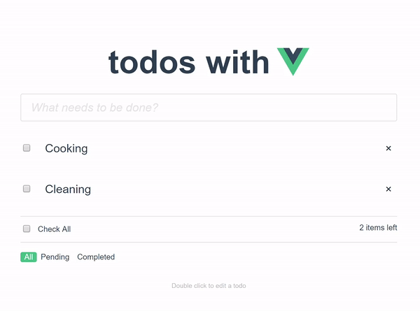

# Vue todos list
This project is todos list that uses vue as js framework and vuex for state management.

### 1. Technology stack:

- vue
- vuex

### 2. Requirements:

- Node.js v10.15.1
- Yarn v1.10.1

### 3. Instructions:

1. Clone repo in your machine
2. run 'yarn install'
3. run 'yarn start'
